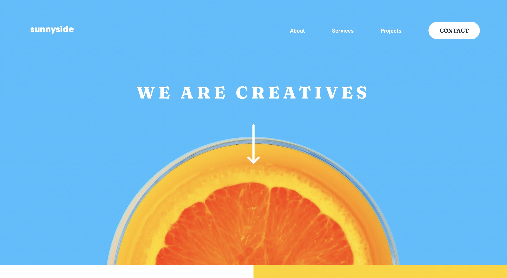

# SCSS_practice

## Table of contents

- [Overview](#overview)
  - [The challenge](#the-challenge)
  - [Screenshot](#screenshot)
- [My process](#my-process)
  - [Built with](#built-with)
  - [What I learned](#what-i-learned)
  - [Continued development](#continued-development)
  - [Useful resources](#useful-resources)
- [Author](#author)

## Overview

### The challenge

Users should be able to:

- View the optimal layout for the site depending on their device's screen size
- See hover states for all interactive elements on the page

### Screenshot



Add a screenshot of your solution. The easiest way to do this is to use Firefox to view your project, right-click the page and select "Take a Screenshot". You can choose either a full-height screenshot or a cropped one based on how long the page is. If it's very long, it might be best to crop it.

## My process

### Built with

- Semantic HTML5
- CSS3 (SCSS)
- Flexbox
- CSS Grid
- Mobile-first workflow
- [Styled Components](https://styled-components.com/) - For styles

### What I learned

Use this section to recap over some of your major learnings while working through this project. Writing these out and providing code samples of areas you want to highlight is a great way to reinforce your own knowledge.

To see how you can add code snippets, see below:

```html
<h1>Some HTML code I'm proud of</h1>
```

```css
.proud-of-this-css {
  color: papayawhip;
}
```

```js
const proudOfThisFunc = () => {
  console.log("🎉");
};
```

### Continued development

Use this section to outline areas that you want to continue focusing on in future projects. These could be concepts you're still not completely comfortable with or techniques you found useful that you want to refine and perfect.

### Useful resources

- [Deciding on a CSS Preprocessor](https://www.lambdatest.com/blog/css-preprocessors-sass-vs-less-vs-stylus-with-examples/?utm_source=Reddit&utm_medium=blog&utm_campaign=PM-080720-1&utm_term=OrganicPosting) - A great article to understand the pros and cons the many CSS preprocessors out there. I went with Sass because it is the most used and they declare variables with **$** instead of **@** like LESS does. I am curious to try PostCSS in the future. 
- [Sass Website](https://sass-lang.com/guide) - You gotta start somewhere! This allowed me to get the SCSS foundations I needed.

## Author

- Website - [Rachel Bozadjian](https://www.your-site.com)

# Frontend Mentor - Sunnyside agency landing page solution

This is a solution to the [Sunnyside agency landing page challenge on Frontend Mentor](https://www.frontendmentor.io/challenges/sunnyside-agency-landing-page-7yVs3B6ef). Frontend Mentor challenges help you improve your coding skills by building realistic projects.
